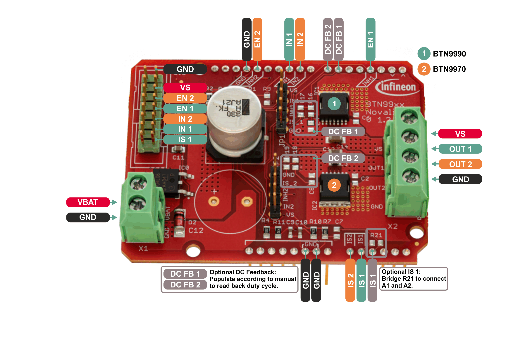

.. _hw-platforms:

Hardware Platforms
==================

DC Motor Control Shield with BTN9970LV and BTN9990LV
""""""""""""""""""""""""""""""""""""""""""""""""""""

Pinout Diagram
^^^^^^^^^^^^^^

Pin Description
^^^^^^^^^^^^^^^

.. list-table::
    :header-rows: 1

    * - Arduino Pin
      - Symbol
      - Type
      - Function
    * - \-
      - VBAT
      - Supply
      - Supply voltage for half bridges (connected to VS through reverse battery protection).
    * - \-
      - VS
      - Power output
      - Supply voltage for external load.
    * - GND
      - GND
      - Supply
      - Ground
    * - 3
      - EN 1
      - Input/digital
      - Enable pin (connected to inhibit input) of device 1 (BTN9990).
    * - 6
      - DC FB 1
      - Output/PWM
      - Duty cycle read back output of device 1 (BTN9990). Not connected by default, can be enabled by populating R16 and R17 according to the `board manual`_.
    * - 7
      - DC FB 2
      - Output/PWM
      - Duty cycle read back output of device 2 (BTN9970). Not connected by default, can be enabled by populating R18 and R19 according to the `board manual`_.
    * - 9
      - IN 2
      - Input/PWM
      - PWM/digital input of device 2 (BTN9970). Use this pin to set the power output of the device to VBAT (1) or GND (0).
    * - 10
      - IN 1
      - Input/PWM
      - PWM/digital input of device 1 (BTN9990). Use this pin to set the power output of the device to VBAT (1) or GND (0).
    * - 13
      - EN 2
      - Input/digital
      - Enable pin (connected to inhibit input) of device 2 (BTN9970).
    * - A0
      - IS 2
      - Output/analog
      - Diagnosis pin of device 2 (BTN9970).
    * - A1
      - IS 1
      - Output/analog
      - Diagnosis pin of device 1 (BTN9990).
    * - A2
      - IS 1
      - Output/analog
      - Diagnosis pin of device 1 (BTN9990). Not connected by default, can be connected to A1/IS1 by bridging R21.
    * - \-
      - OUT 1
      - Power output
      - Power output of half bridge device 1 (BTN9990).
    * - \-
      - OUT 2
      - Power output
      - Power output of half bridge device 2 (BTN9970).

.. _`board manual`: https://www.infineon.com/dgdl/Infineon-User_manual_for_NovalithIC_BTN9970LVBTN9990_motor_control_shield-UserManual-v01_00-EN.pdf?fileId=8ac78c8c7d0d8da4017d0fb6fdc12cca

Supported MCU Platforms
"""""""""""""""""""""""

In principle, the library is supported by any Arduino compatible MCU platform.
Its Arduino core needs to implement the `Arduino reference language <https://www.arduino.cc/reference/en/>`_.

Verified MCU Boards
^^^^^^^^^^^^^^^^^^^
The library examples have been built and successfully executed on the following hardware platforms:

.. list-table::
    :header-rows: 1

    * - MCU Platforms
    * - `KIT_XMC11_BOOT_001 <https://www.infineon.com/cms/en/product/evaluation-boards/kit_xmc11_boot_001>`_
    * - `KIT_XMC14_2GO  <https://www.infineon.com/cms/en/product/evaluation-boards/kit_xmc14_2go>`_
    * - `KIT_XMC47_RELAX_LITE_V1 <https://www.infineon.com/cms/de/product/evaluation-boards/kit_xmc47_relax_lite_v1>`_
    * - `Arduino Uno Rev3 <https://store.arduino.cc/arduino-uno-rev3>`_

Find out which boards are build checked under continuous integration `here <https://github.com/Infineon/arduino-motix-btn99x0/blob/master/.github/workflows/build-check.yml>`_.

Known Issues
^^^^^^^^^^^^
* When using the Infineon `XMC for Arduino`_ boards: The analog input pins **cannot** be set as analog outputs, which affects current and temperature measurement on these boards. If you want to use this functionality please use jumper wires to different pins.
* When using the Infineon `XMC for Arduino`_ boards: PWM functionality works only on XMC for Arduino >= 2.0.1

.. _`XMC for Arduino`: https://github.com/Infineon/XMC-for-Arduino