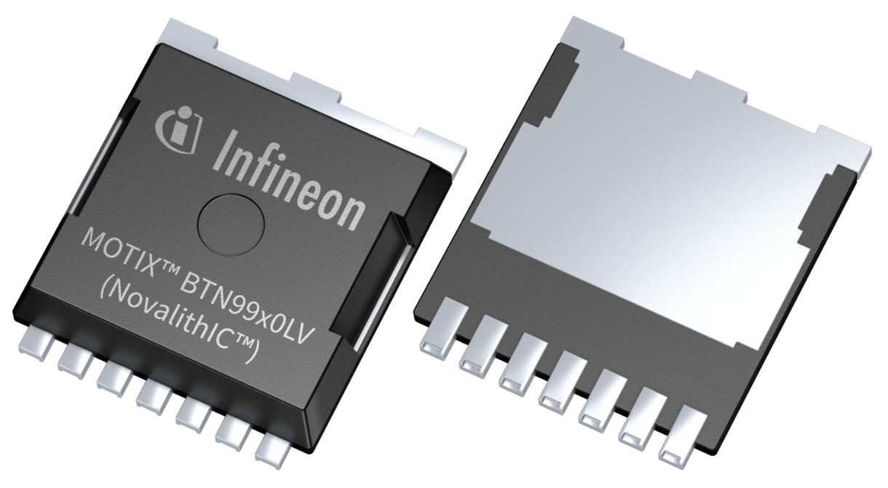
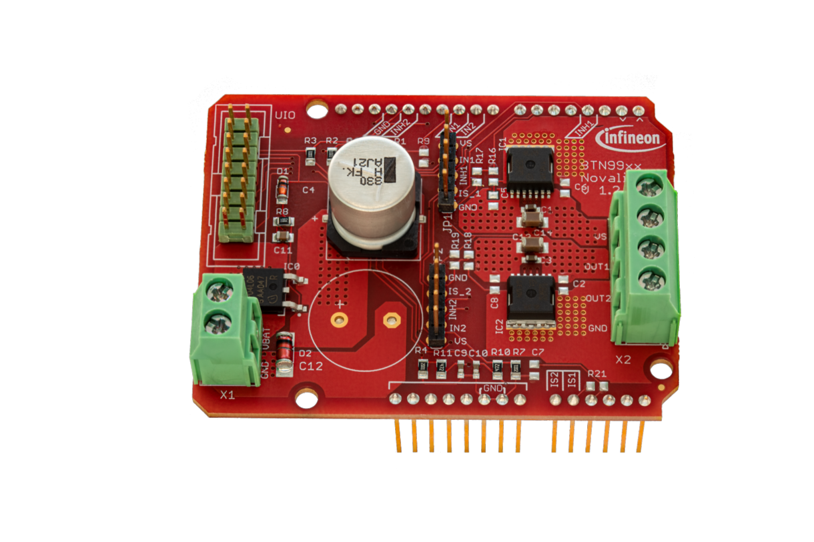

************
Introduction
************

.. |trade|    unicode:: U+2122 .. TRADEMARK SIGN

Welcome to the Infineon MOTIX\ |trade|\  BTN99x0 Arduino library docs!

.. image:: img/arduino-logo.png
    :height: 75

Scope
=====
This library covers the following products:

MOTIX\ |trade|\  Single Half-Bridge ICs
--------------------------------------

* `DC Motor Control Shield with BTN9970LV and BTN9990LV`_

* `BTN9970LV`_
* `BTN9990LV`_

.. _`DC Motor Control Shield with BTN9970LV and BTN9990LV`: https://www.infineon.com/cms/de/product/evaluation-boards/dc-shield_btn9970lv/
.. _`BTN9970LV`: https://www.infineon.com/cms/en/product/power/motor-control-ics/brushed-dc-motor-driver-ics/single-half-bridge-ics/btn9970lv/
.. _`BTN9990LV`: https://www.infineon.com/cms/en/product/power/motor-control-ics/brushed-dc-motor-driver-ics/single-half-bridge-ics/btn9990lv/

License
=======

Find the license for this library `here <https://github.com/Infineon/arduino-motix-btn99x0/blob/master/LICENSE>`_.

.. toctree::
   :maxdepth: 3
   :caption: Wiki Sections
   :hidden:

   Introduction <self>
   Getting Started <getting-started.rst>
   Hardware Platforms <hw-platforms.rst>
   Library Installation <lib-install.rst>
   Examples <examples.rst>
   API Reference <api-ref.rst>